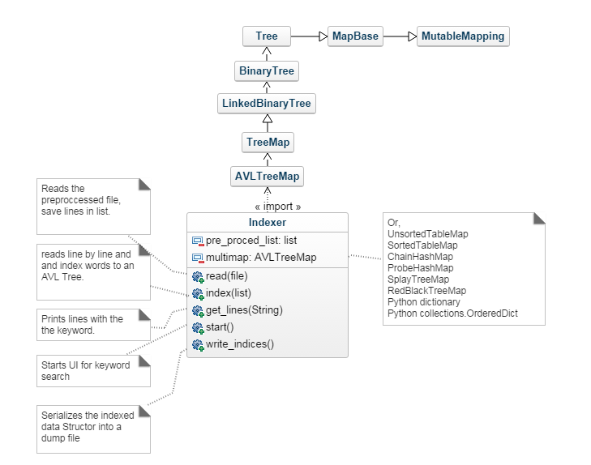

Description
-----
This application parses over a text document(ANSI-ASCII) removes common english
pronoun and punctuation and save the result as a preprocessed file.
The application also parse over the preprocessed file and indexes
all the words. As an optional feature, it can return an index file of the
preprocessed document.

Dependencies
-----
avl_tree.py
binary_search_tree.py
binary_tree.py
chain_hash_map.py
Empty.py
Indexer.py
linked_binary_tree.py
linked_queue.py
map_base.py
preprocessor.py
probe_hash_map.py
project4.py
red_black_tree.py
sorted_table_map.py
splay_tree.py
tree.py
unsorted_table_map.py

Requirements
-----
- Python 3
    -- argparse
    -- sys
    -- time
    -- collections
    -- random
- Input files
    -- A text document for indexing with ANSI-ISO encoding

Run as
-----
python3 project4.py [-h] [--index  INDEXED] [--map MAP_TYPE] original preprocessed
python3 preprocessor.py [-h] [--output OUTPUT] input stopwords

Operation
-----
Prompt for a lookup word after indexing.
Prompt for quit or another lookup after each search.

Output
-----
- preprocessed.py
    Returns total removed stopwords and short words (less than 3 characters)
    on screen after processing the input file.
- project4.py
    - Returns a stat table for given original text file consisting of the
      followings on screen:
        - Indexing process duration
        - Total number of indexed terms
        - Average number of indexed words' frequency
        - Median number of indexed words' frequency
    - Return the type of map used for the search based on --map option.
    - Returns following items on screen if search keyword was found:
        - displays lines that contain the searched keyword with line numbers
         from the original file.
        - Number of times keyword is used in the original file.
        - Lookup process duration in seconds
    - Returns unsuccessful search warning if search keyword was not found.
    
  Hierarchy
  -----
  
